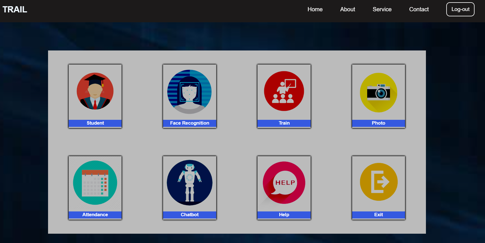
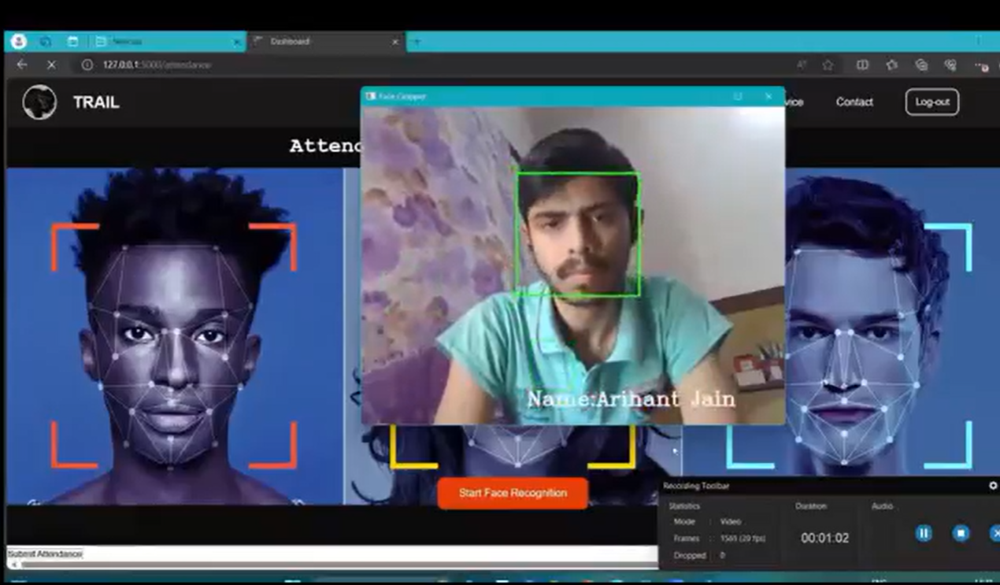
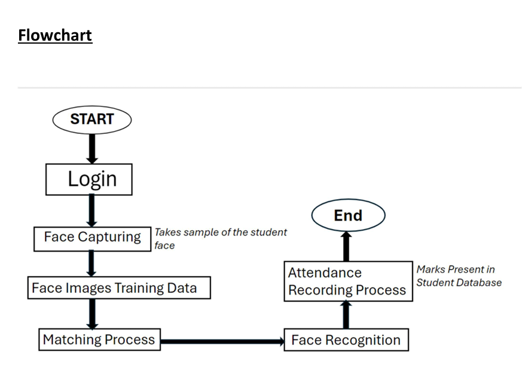

# Face Recognition Attendance System

A web-based system that marks student attendance using facial recognition, ensuring accuracy and saving time.

## Screenshot
 

 
 
## Video
TO Watch full project Working and its Responsive UI.
Link: https://youtu.be/KDqpDbOfjPM

## Technologies Used
- Python
- OpenCV (for face recognition)
- Haarcascade (for object detection)
- LBPH Classifier (for facial recognition)
- Flask (for web backend)
- HTML, CSS, JavaScript (for the frontend)

## FlowChart
  

## Installation

- Clone the repository:
   ```bash
   git clone https://github.com/jainArihant12/Attendance-using-face-recognition.git

- Navigate into the project folder:
   ```bash
   cd Face_recognition

- Install dependencies using pip:
   ```bash
   pip install -r requirements.txt

- Make sure you have the necessary libraries installed:
   ```bash
   pip install opencv-python flask

- Run the Flask app:
   ```bash
   python app.py

- Open your browser and visit this  access the system.
   ```bash
   http://127.0.0.1:5000/

## Usage
  - **Step 0** : Login in using "rahul@gmail.com " and Password "1212" Or Register
  - **Step 1** : Go to dashboard.
  - **Step 2** : Go to Face_recognition and collect dataset(image) of each student.
  - **Step 3** :From dashboard , Go to Train section to train the images.
  - **Step 4**: Once the training is complete, you can mark attendance by navigating to the Attendance section of the website.
  - **Step 5**:Perform face recognition, and attendance will be marked automatically when a face matches. 
  - **Step 6**: To check attendance , Go to Student section on dashboard and you get all attendance of student with date and time.


## LICENSE
   This project has its own license


